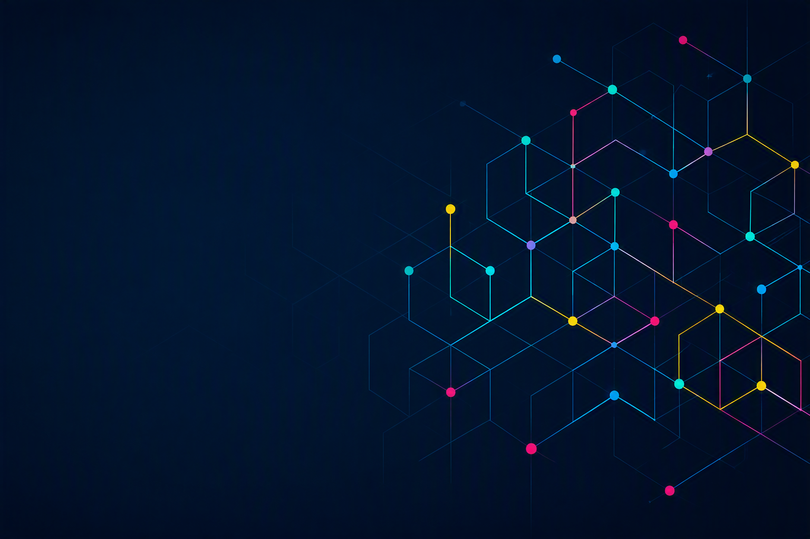

# Welcome to FRAMily

### The International FRAM Community

**Connecting People. Navigating Complexity. Building Resilience.**

FRAMily is an international community of researchers, practitioners, 
educators, and students interested in the Functional Resonance Analysis 
Method (FRAM).

We foster open knowledge exchange, shared learning, collaboration, and 
the responsible development and application of FRAM across research, 
education, and practice.

## Explore our repositories

| Repository | Description |
|------------|-------------|
| 🌍 [FRAMily Community](https://github.com/FRAMily-Community/framily-community) | Community discussions, announcements, ideas, collaboration opportunities, and knowledge exchange within the international FRAM community. |
| 🧩 [FRAM Model Repository](https://github.com/FRAMily-Community/fram-model-repository) | Community repository for FRAM models, examples, and case studies. |
| 🎓 [FRAM Learning Material](https://github.com/FRAMily-Community/fram-learning-material) | Educational resources, tutorials, exercises, and teaching materials for learning and teaching FRAM. |
| 💻 [FRAM Software](https://github.com/FRAMily-Community/fram-software) | Software tools, applications, documentation, and digital resources supporting FRAM research, education, and practice. |
| 📚 [FRAM Resource Library](https://github.com/FRAMily-Community/fram-resource-library) | Curated collection of publications, case studies, references, and community resources related to FRAM and resilience engineering. |

## Join the Conversation

The [FRAMily Community Discussions](https://github.com/FRAMily-Community/framily-community) provide a shared space to ask questions, exchange experiences, present models, discuss research, explore software, develop ideas, and connect with other members of the international FRAM community.

Discussion categories include:
- 📢 **Announcements**
- 🤝 **Collaborations**
- 🌍 **General Discussion**
- 💡 **Ideas & Future Directions**
- 🧩 **Model Showcase**
- 🔬 **Research**
- 💻 **Software & Tools**
- 🎓 **Teaching & Learning**

[Join the FRAMily Discussions](https://github.com/FRAMily-Community/framily-community)

## Community activities

- FRAMily Meetings
- FRAM Fridays
- FRAM Summer School
- Research and practice collaborations
- Software and model development
- Open educational resources

## Join the FRAMily

We welcome researchers, practitioners, educators, developers, and students interested in understanding complex socio-technical systems and strengthening resilient performance.

### Connect with us

🌐 **Website**  
[functionalresonance.com](https://functionalresonance.com)

💼 **LinkedIn**  
[FRAMily | The International FRAM Community](https://www.linkedin.com/company/framily-community/about/?viewAsMember=true)

🎥 **YouTube**  
[FRAMILY Community Channel](https://www.youtube.com/@framily-community)

---

**Connecting People. Navigating Complexity. Building Resilience.**
